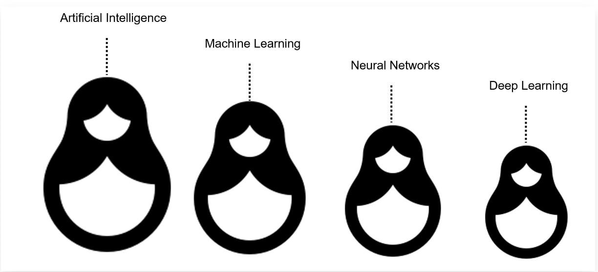
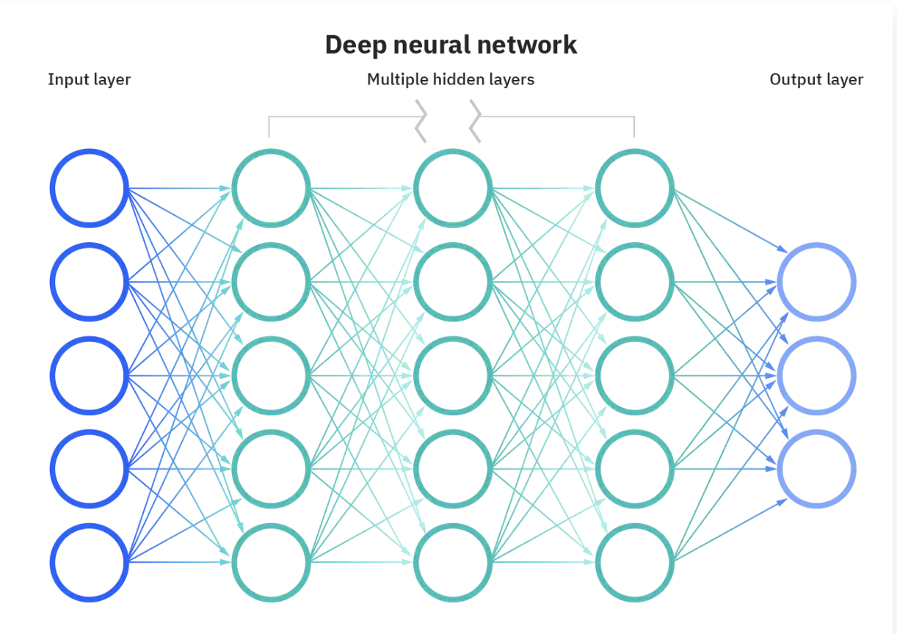

# What is Data Science? (Week 1 - 2022/12/18) 

1. Data science is the study of large quantities of data, which can reveal insights that help organizations make strategic choices.

2. Data scientists need to be curious, judgemental and argumentative.

3. a little science + a little math + a lot of curiosity about data -> data science .

**The sexiest job in the 21st century! (Do you really believe this haha?)**

## What do Data Science do? (Week 1 - 2022/12/19)

1. Data Scientist: someone who finds solutions to problems by analyzing Big or small data using appropriate tools and then tells stories to communicate her findings to the relevant stakeholders. 

2. The typical work day for a Data Scientist varies depending on what type of project they are working on.

3. Many algorithms are used to bring out insights from data. [Table(excel) -> structured data; From web(text, audio or video) -> unstructured data]

4. Accessing algorithms, tools, and data through the **Cloud** enables Data Scientists to stay up-to-date and collaborate easily.

## Big Data and Data Mining (Week 2 - 2022/12/20)

### Foundations of Big Data
1. **Big Data:** Big Data refers to the dynamic, large and disparate volumes of data being created by people, tools, and machines. It requires new, innovative, and scalable technology to collect, host, and analytically process the vast amount of data gathered in order to derive real-time business insights that relate to consumers, risk, profit, performance, productivity management, and enhanced shareholder value. -by Ernst and Young

2. **The V's of Big Data**
    - Velocity: the speed at which data accumulates  
    - Volume: the scale of the data, or the increase in the amount of data stored
    - Variety: the diversity of the data
    - Veracity: the quality and origin of data, and its conformity to facts and accuracy
    - Value: the ability and need to turn data into value. 

### What is Hadoop?
Apache Hadoop is an open source framework that is used to efficiently store and process large datasets ranging in size from gigabytes to petabytes of data. Instead of using one large computer to store and process the data, Hadoop allows clustering multiple computers to analyze massive datasets in parallel more quickly.

### How Big Data is Driving Digital Transformation?
1. **Digital Transformation:** 
    - it affects business operations, updating existing processes and operations and creating new ones to harness the benefits of new technologies. This digital change integrates digital technology into all areas of an organization resulting in fundamental changes to how it operates and delivers value to customers.    

    - It is not simply duplicating existing processes in digital form; the in-depth analysis of how the business operates helps organizations discover how to improve their processes and operations, and harness the benefits of integrating data science into their workflows. Most organizations realize that digital transformation will require fundamental changes to their approach towards data, employees, and customers, and it will affect their organizational culture. 

### Summary
In this lesson, you have learned:

1. How Big Data is defined by the Vs: Velocity, Volume, Variety, Veracity, and Value.

2. How Hadoop and other tools, combined with distributed computing power,  are used to handle the demands of Big Data.  

3. What skills are required to analyse Big Data. 

4. About [the process of Data Mining](https://cf-courses-data.s3.us.cloud-object-storage.appdomain.cloud/IBMDeveloperSkillsNetwork-DS0101EN-SkillsNetwork/labs/Module%202/Data_Mining.md.html?origin=www.coursera.org), and how it produces results. 

## Deep Learning and Machine Learning (Week 2 - 2022/12/21)

### What's the difference between these key words?

|   Big Data    |  Data Mining          | Machine Learning  | Deep Learning | Artificial Intelligence | Data Science |
| ------------- | -------------| ----- | ---------------- | ---------------- | ---------------- |
|  Data sets that are so massive, so quickly built, and so varied that they defy traditional analysis methods such as you might perform with a relational database.  | Data mining is the process of automatically searching and analyzing data, discovering previously unrevealed patterns. It involves preprocessing the data to prepare it and transforming it into an appropriate format. | Machine learning is a subset of AI that uses computer algorithms to analyze data and make intelligent decisions based on what it is learned without being explicitly programmed. | Deep learning is a specialized subset of machine learning that uses layered neural networks to simulate human decision-making. | Data Science is the process and method for extracting knowledge and insights from large volumes of disparate data. It's an interdisciplinary field involving mathematics, statistical analysis, data visualization, machine learning, and more. | AI includes everything that allows computers to learn how to solve problems and make intelligent decisions. |
| The five V's; velocity, volume, variety, veracity, and value. | Once this is done, insights and patterns are mined and extracted using various tools and techniques ranging from simple data visualization tools to machine learning and statistical models. |  Machine learning algorithms are trained with large sets of data and they learn from examples. They do not follow rules-based algorithms. Machine learning is what enables machines to solve problems on their own and make accurate predictions using the provided data. | Deep learning algorithms can label and categorize information and identify patterns. It is what enables AI systems to continuously learn on the job and improve the quality and accuracy of results by determining whether decisions were correct. | It's what makes it possible for us to appropriate information, see patterns, find meaning from large volumes of data and use it to make decisions that drive business. Data Science can use many of the AI techniques to derive insight from data. For example, it could use machine learning algorithms and even deep learning models to extract meaning and draw inferences from data. |  Both AI and Data Science can involve the use of big data. That is, significantly large volumes of data. |
| | | |  Artificial neural networks, often referred to simply as neural networks, take inspiration from biological neural networks, although they work quite a bit differently. A neural network in AI is a collection of small computing units called neurons that take incoming data and learn to make decisions over time. |

**There is some interaction between AI and Data Science, but one is not a subset of the other. Rather, Data Science is a broad term that encompasses the entire data processing methodology while AI includes everything that allows computers to learn how to solve problems and make intelligent decisions. Both AI and Data Science can involve the use of big data. That is, significantly large volumes of data.**

### [Neural Networks and Deep Learning](https://www.ibm.com/cloud/blog/ai-vs-machine-learning-vs-deep-learning-vs-neural-networks)

1. Neural networks—and more specifically, artificial neural networks (ANNs)—mimic the human brain through a set of algorithms. At a basic level, a neural network is comprised of four main components: inputs, weights, a bias or threshold, and an output. Similar to linear regression, the algebraic formula would look something like this:

2.  The “deep” in deep learning is referring to the **depth of layers in a neural network.** A neural network that consists of **more than three layers, which would be inclusive of the inputs and the output** —can be considered a deep learning algorithm. This is generally represented using the following diagram:

### Summary

1. The differences between some common Data Science terms, including Deep Learning and Machine Learning.

2. Deep Learning is a type of Machine Learning that simulates human decision-making using neural networks.

3. Machine Learning has many applications, from recommender systems that provide relevant choices for customers on commercial websites, to detailed analysis of financial markets.

4. [How to use regression to analyze data. (house price through regression)](https://cf-courses-data.s3.us.cloud-object-storage.appdomain.cloud/IBMDeveloperSkillsNetwork-DS0101EN-SkillsNetwork/labs/Module%202/Reading_Regression.md.html?origin=www.coursera.org)

## Data Science in Business (Week 3 - 2022/12/22)

### Summary

1. Data Science helps physicians provide the best treatment for their patients, and helps meteorologists predict the extent of local weather events, and can even help predict natural disasters like earthquakes and tornadoes.

2. That companies can start on their data science journey by capturing data. Once they have data, they can begin analysing it.

3. Some ways that data is generated by consumers. 

4. How businesses like Netflix, Amazon, UPs, Google, and Apple use the data generated by their consumers and employees.

5. The purpose of the final deliverable of a Data Science project is to communicate new information and insights from the data analysis to key decision-makers.

## Careers and Recruiting in Data Science (Week 3 - 2022/12/23)

### Summary
1. Data Scientists need programming, mathematics, and database skills, many of which can be gained through self-learning.

2. Companies recruiting for a Data Science team need to understand the variety of different roles Data Scientists can play, and look for soft skills like storytelling and relationship building as well as technical skills.

3. High school students considering a career in Data Science should learn programming, math, databases, and, most importantly practice their skills.

## The Report Structure (Week 3 - 2022/12/23)

### [Summary](https://cf-courses-data.s3.us.cloud-object-storage.appdomain.cloud/IBMDeveloperSkillsNetwork-DS0101EN-SkillsNetwork/labs/Module%203/ReadingReportStructure.md.html?origin=www.coursera.org)
1. The length and content of the final report will vary depending on the needs of the project.

2. The structure of the final report for a Data Science project should include a cover page, table of contents, executive summary, detailed contents, acknowledgements, references and appendices.

3. The report should present a thorough analysis of the data and communicate the project findings.

# Tools for Data Science

## Languages of Data Science (Week 1 - 2022/12/26)
| Python | R Language | SQL | Java | Scala | C++ | Julia | JavaScript|
| -------|-------|-------|-------|-------|-------|-------|-------|
| 1. Python is a high-level general-purpose programming language that can be applied to many different classes of problems. | ● R has become the world’s largest repository of statistical knowledge. | Many people do not consider SQL to be like other software development languages because it's a non-procedural language and its scope is limited to querying and managing data. While it is not a “data science” language per se, data scientists regularly use it because it's simple and powerful! | Java is a tried-and-true general-purpose object oriented programming language. It's been widely adopted in the enterprise space and is designed to be fast and scalable. Java applications are compiled to bytecode and run on the Java Virtual Machine, or "JVM." Some notable data science tools built with Java include Weka, for data mining; Java-ML, which is a machine learning library; Apache MLlib, which makes machine learning scalable; and Deeplearning4j, for deep learning. Apache Hadoop is another Java-built application. It manages data processing and storage for big data applications running in clustered systems. | Scala is a general-purpose programming language that provides support for functional programming and a strong static type system. Many of the design decisions in the construction of the Scala language were made to address criticisms of Java. Scala is also interoperable with Java, as it runs on the JVM. The name "Scala" is a combination of "scalable" and "language." This language is designed to grow alongwith the demands of its users. For data science, the most popular program built using Scala is Apache Spark. Spark is a fast and general-purpose cluster computing system. It provides APIs that make parallel jobs easy to write, and an optimized engine that supports general computation graphs. Spark includes Shark, which is a query engine; MLlib, for machine learning; GraphX, for graph processing; and Spark Streaming. Apache Spark was designed to be faster than Hadoop. | C++ is a general-purpose programming language. It is an extension of the C programming language, or "C with Classes.” C++ improves processing speed, enables system programming, and provides broader control over the software application. Many organizations that use Python or other high-level languages for data analysis and exploratory tasks still rely on C++ to develop programs that feed that data to customers in real-time. For data science, a popular deep learning library for dataflow called TensorFlow was built with C++. But while C++ is the foundation of TensorFlow, it runs on a Python interface, so you don’t need to know C++ to use it. MongoDB, a NoSQL database for big data management, was built with C++. Caffe is a deep learning algorithm repository built with C++, with Python and MATLAB bindings. | Julia was designed at MIT for high-performance numerical analysis and computational science. It provides speedy development like Python or R, while producing programs that run as fast as C or Fortran programs. Julia is compiled, which means that the code is executed directly on the processor as executable code; it calls C, Go, Java, MATLAB, R, Fortran, and Python libraries; and has refined parallelism. The Julia language is relatively new, having been written in 2012, but it has a lot of promise for future impact on the data science industry. JuliaDB is a particularly useful application of Julia for data science. It's a package for working with large persistent data sets. | A core technology for the World Wide Web, JavaScript is a general-purpose language that extended beyond the browser with the creation of Node.js and other server-side approaches. Javascript is NOT related to the Java language. For data science, the most popular implementation is undoubtedly TensorFlow.js. TensorFlow.js makes machine learning and deep learning possible in Node.js as well as in the browser. TensorFlow.js was also adopted by other open source libraries, including brain.js and machinelearn.js. The R-js project is another great implementation of JavaScript for data science. R-js has re-written linear algebra specifications from the R Language into Typescript. This re-write will provide a foundation for other projects to implement more powerful math base frameworks like Numpy and SciPy of Python. Typescript is a superset of JavaScript. |
|2. It has a large, standard library that provides tools suited to many different tasks, including but not limited to databases, automation, web scraping, text processing, image processing, machine learning, and data analytics. | ● As of 2018, R has more than 15,000 publicly released packages, making it possible to conduct complex exploratory data analysis. | Knowing SQL will help you do many different jobs in data science, including business and data analyst, and it's a must in data engineering. When performing operations with SQL, you access the data directly. There's no need to copy it beforehand. This can speed up workflow executions considerably. | 
|3. For data science, you can use Python's scientific computing libraries such as Pandas, NumPy, SciPy, and Matplotlib. | ● R integrates well with other computer languages, such as C++, Java, C, .Net, and Python. | SQL is the interpreter between you and the database. SQL is an American National Standards Institute, or "ANSI," standard, which means if you learn SQL and use it with one database, you will be able to easily apply that SQL knowledge to many other databases. |
|4. For artificial intelligence, it has TensorFlow, PyTorch, Keras, and Scikit-learn. | ● Common mathematical operations such as matrix multiplication work straight out of the box. | There are many different SQL databases available, including MySQL, IBM Db2, PostgreSQL, Apache OpenOffice Base, SQLite, Oracle, MariaDB, Microsoft SQL Server, and more. The syntax of the SQL you write might change a little bit based on the relational database management system you’re using. |
|5. Python can also be used for Natural Language Processing (NLP) using the Natural Language Toolkit (NLTK). Another great selling point is the Python community, which has a well documented history of paving the way for diversity and inclusion efforts in the tech industry as a whole. | ● R has stronger object-oriented programming facilities than most statistical computing languages. There are many ways to connect with other R users around the globe. Communities such as user!, WhyR?, SatRdays, and R-Ladies are all great to connect with. And you can also check out the R project website for R conferences and events.| If you are looking to learn SQL you would be best served to focus on a specific relational database and then plug into the community for that specific platform. There are also many great introductory courses on SQL available! |

